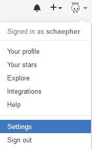
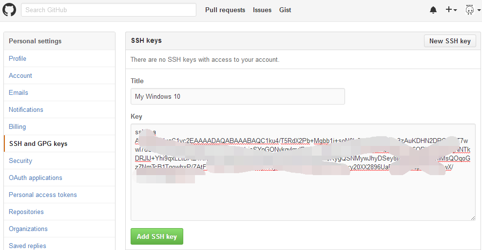
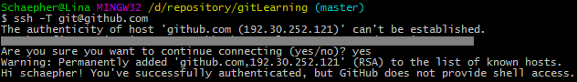
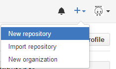
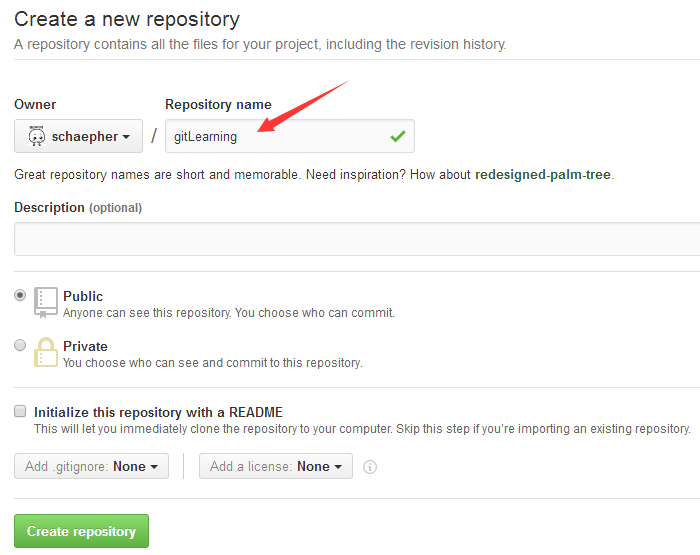
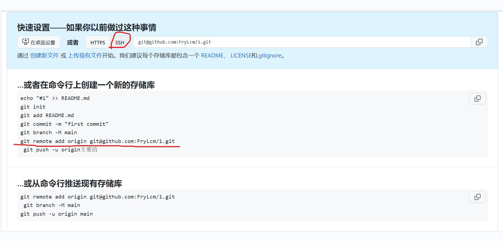

#  git工作流程

我们知道Git有三大区（**工作区、暂存区、版本库**）以及几个状态（**untracked、unstaged、uncommited**），下面只是简述下Git的大概工作流程，详细的可以参见其他有关Git的文章[【链接】。](http://www.cnblogs.com/cposture/category/642672.html)  

（1）打开你的项目文件夹，除了隐藏的.git文件夹，其他项目文件位于的地方便是工作区，工作区的文件需要添加到Git的暂存区（git add），随后再提交到Git的版本库（git commit）。

（2）首次新建的文件都是untracked状态（未跟踪），此时需要git  add到暂存区，Git便会在暂存区中生成一个该文件的索引，文件此时处于uncommited状态，需要git  commit生成版本库。添加到了版本库之后，再对文件进行修改，那么文件的状态会变为unstaged状态。

简单的认识了Git的工作流程，接下来便可以看看如何删除错误添加到暂存区或版本库里的文件了！


# 1 删除错误添加到暂存区的文件

有时你在工作区新建了文件TestFile，并且已经将它添加到了暂存区，git会告知，现有有一个文件未提交到版本库

### 1.1 仅仅删除暂存区里的文件    

​    此时你想撤销错误添加到暂存区里的文件，可以输入以下命令：

```
git rm --cache 文件名
```

 上面的命令仅仅删除暂存区的文件而已，不会影响工作区的文件，如上图，TestFile.txt仍然存在，此时输入下面命令，git会告知有一个未跟踪的文件TestFile.txt。

```
git status
```


### 1.2 删除暂存区和工作区的文件

```
git rm -f 文件名
```

**工作区的文件也被删除了。**

# 2 删除错误提交的commit

有时，不仅添加到了暂存区，而且commit到了版本库，这个时候就不能使用git rm了，需要使用git reset命令。

**错误提交到了版本库，此时无论工作区、暂存区，还是版本库，这三者的内容都是一样的**，所以在这种情况下，只是删除了工作区和暂存区的文件，下一次用该版本库回滚那个误添加的文件还会重新生成。

这个时候，我们必须撤销版本库的修改才能解决问题！

git reset有三个选项，--hard、--mixed、--soft。

```
//仅仅只是撤销已提交的版本库，不会修改暂存区和工作区
git reset --soft 版本库ID
```

 

```
//仅仅只是撤销已提交的版本库和暂存区，不会修改工作区
git reset --mixed 版本库ID
```

 

```
//彻底将工作区、暂存区和版本库记录恢复到指定的版本库
git reset --hard 版本库ID
```

​    那我们到底应该用哪个选项好呢？

​    （1）如果你是在提交了后，对工作区的代码做了修改，并且想保留这些修改，那么可以使用git reset --mixed 版本库ID，注意这个版本库ID应该不是你刚刚提交的版本库ID，而是**刚刚提交版本库的上一个版本库**。

​    （2）如果不想保留这些修改，可以直接使用彻底的恢复命令，git reset --hard 版本库ID。

​    （3）为什么不使用--soft呢，因为它只是恢复了版本库，**暂存区仍然存在你错误提交的文件索引**，还需要进一步使用上一节的删除错误添加到暂存区的文件，详细见上文。


# git命令分类整理

### 全局设置

    git config --global user.name xxx：设置全局用户名，信息记录在~/.gitconfig文件中
    git config --global user.email xxx@xxx.com：设置全局邮箱地址，信息记录在~/.gitconfig文件中
    git init：将当前目录配置成git仓库，信息记录在隐藏的.git文件夹中

### 常用命令

    git add XX ：将XX文件添加到暂存区
    git commit -m "给自己看的备注信息"：将暂存区的内容提交到当前分支
    git status：查看仓库状态 	--git status 命令用于查看在你上次提交之后是否有对文件进行再次修改。
    git log：查看当前分支的所有版本
    git push -u (第一次需要-u以后不需要) ：将当前分支推送到远程仓库
    git clone git@git.acwing.com:xxx/XXX.git：将远程仓库XXX下载到当前目录下
    git branch：查看所有分支和当前所处分支

### 查看命令

    git diff XX：查看XX文件相对于暂存区修改了哪些内容
    git status：查看仓库状态
    git log：查看当前分支的所有版本
    git log --pretty=oneline：用一行来显示
    git reflog：查看HEAD指针的移动历史（包括被回滚的版本）
    git branch：查看所有分支和当前所处分支
    git pull ：将远程仓库的当前分支与本地仓库的当前分支合并

### 删除命令

    git rm --cached XX：将文件从仓库索引目录中删掉，不希望管理这个文件
    git restore --staged xx：==将xx从暂存区里移除==
    git checkout — XX或git restore XX：==将XX文件尚未加入暂存区的修改全部撤销==

### 代码回滚

    git reset --hard HEAD^ 或git reset --hard HEAD~ ：将代码库回滚到上一个版本
    git reset --hard HEAD^^：往上回滚两次，以此类推
    git reset --hard HEAD~100：往上回滚100个版本
    git reset --hard 版本号：回滚到某一特定版本

### 远程仓库

    git remote add origin git@git.acwing.com:xxx/XXX.git：将本地仓库关联到远程仓库
    git push -u (第一次需要-u以后不需要) ：将当前分支推送到远程仓库
    git push origin branch_name：将本地的某个分支推送到远程仓库
    git clone git@git.acwing.com:xxx/XXX.git：将远程仓库XXX下载到当前目录下
    git push --set-upstream origin branch_name：设置本地的branch_name分支对应远程仓库的branch_name分支
    git push -d origin branch_name：删除远程仓库的branch_name分支
    git checkout -t origin/branch_name 将远程的branch_name分支拉取到本地
    git pull ：将远程仓库的当前分支与本地仓库的当前分支合并
    git pull origin branch_name：将远程仓库的branch_name分支与本地仓库的当前分支合并
    git branch --set-upstream-to=origin/branch_name1 branch_name2：将远程的branch_name1分支与本地的branch_name2分支对应

### 分支命令

    git branch branch_name：创建新分支
    git branch：查看所有分支和当前所处分支
    git checkout -b branch_name：创建并切换到branch_name这个分支
    git checkout branch_name：切换到branch_name这个分支
    git merge branch_name：将分支branch_name合并到当前分支上
    git branch -d branch_name：删除本地仓库的branch_name分支
    git push --set-upstream origin branch_name：设置本地的branch_name分支对应远程仓库的branch_name分支
    git push -d origin branch_name：删除远程仓库的branch_name分支
    git checkout -t origin/branch_name 将远程的branch_name分支拉取到本地
    git pull ：将远程仓库的当前分支与本地仓库的当前分支合并
        git pull origin branch_name：将远程仓库的branch_name分支与本地仓库的当前分支合并
    git branch --set-upstream-to=origin/branch_name1 branch_name2：将远程的branch_name1分支与本地的branch_name2分支对应

### stash暂存

    git stash：将工作区和暂存区中尚未提交的修改存入栈中
    git stash apply：将栈顶存储的修改恢复到当前分支，但不删除栈顶元素
    git stash drop：删除栈顶存储的修改
    git stash pop：将栈顶存储的修改恢复到当前分支，同时删除栈顶元素
    git stash list：查看栈中所有元素

git常用操作

git删除暂存区或版本库中的文件

# git一般步骤

`git config --global user.name xxx`：设置全局用户名，信息记录在~/.gitconfig文件中

`git config --global user.email xxx@xxx.com`：设置全局邮箱地址，信息记录在~/.gitconfig文件中

.gitconfig文件在家目录下，可以直接vim .gitconfig查看内容

先创建一个文件夹，再

`git init`：将当前目录配置成git仓库，信息记录在隐藏的.git文件夹中

这时可以在该文件夹下进行项目建设

`git status`：查看仓库状态，此时已修改的文件显示为红色，表示这些文件还未加入到暂存区中

```
git add XX：将XX文件添加到暂存区
git add .：将所有待加入暂存区的文件加入暂存区
```

：将修改后的文件加入到暂存区

此时再用`git status`，之前的红色文件会显示为绿色，表示现在已经加入到暂存区中。

`git commit -m "给自己看的备注信息"`：将暂存区的内容提交到当前分支

`git diff XX`：查看XX文件相对于暂存区修改了哪些内容，显示已写入暂存区和已经被修改但尚未写入暂存区文件的区别。 

显示暂存区和上一次提交(commit)的差异: 

```
git diff --cached XX
或
git diff --staged XX
```

显示两次提交(commit)之间的差异: 

```
 git diff [first-branch]...[second-branch]
```

git删除暂存区中或已经commit到版本库中的文件，详情请阅读本文最上面。

```
git log：查看当前分支的所有版本

git log --pretty=oneline：用一行来显示
```

`git reflog`：查看HEAD指针的移动历史（包括被回滚的版本）

    git reset --hard HEAD^ 
    或
    git reset --hard HEAD~：将代码库回滚到上一个版本
    git reset --hard HEAD^^：往上回滚两次，以此类推
    git reset --hard HEAD~100：往上回滚100个版本
    git reset --hard 版本号：回滚到某一特定版本
    版本号可以用上面的git log来查看（前七位）
`git checkout — XX`或`git restore XX`：将XX文件尚未加入暂存区的修改全部撤销,就是将工作区的内容回滚到暂存区中，若此时暂存区无内容，则回滚到HEAD结点指向的版本。

ACgit设置中文：右上角，点击偏好设置，往下翻找到language，点击保存修改，over。

用ACgit之前得先添加ssh密钥，就是进入.ssh文件夹，找到id_rsa.pub，将里面的公钥复制到ACgit添加ssh密钥那里。若还未生成密钥公钥，可以到ssh登录那一章学习。

开始连接ACgit，并且将本地仓库推送到ACgit远程仓库上

```
git remote add origin git@git.acwing.com:xxx/XXX.git：将本地仓库关联到远程仓库

git push -u (第一次需要-u以后不需要)：将当前分支推送到远程仓库

git push origin branch_name：将本地的某个分支推送到远程仓库（acwing上的branch_name是master）

```

这时如果想把ACgit远程仓库中的文件克隆下来，可以

```
git clone git@git.acwing.com:xxx/XXX.git：将远程仓库XXX下载到当前目录下

```

分支

```
git checkout -b branch_name：创建并切换到branch_name这个分支

git branch：查看所有分支和当前所处分支

git checkout branch_name：切换到branch_name这个分支

git merge branch_name：将分支branch_name合并到当前分支上
如果合并产生冲突，需要自己手动进入产生冲突的文件，将里面的内容按自己的想法进行更改，最后还需add和commit一下。

git branch -d branch_name：删除本地仓库的branch_name分支

git branch branch_name：创建新分支

```

更改完成后，需要git push同步到远程仓库。

创建了分支，需要将分支提交到云端，此时直接git push不行，因为云端上还没有这个分支，需要

```
git push --set-upstream origin branch_name：设置本地的branch_name分支对应远程仓库的branch_name分支,
```

本地仓库的分支和远程仓库的分支具有一定的独立性，在本地删除分支在云端上不会删除，在云端上删除分支在本地上不会删除，需要自己手动删除。

```
git push -d origin branch_name：删除远程仓库的branch_name分支
```

这里还得去找资料学习一下！（1：33：10）

```
git pull：将远程仓库的当前分支与本地仓库的当前分支合并

git pull origin branch_name：将远程仓库的branch_name分支与本地仓库的当前分支合并

git branch --set-upstream-to=origin/branch_name1 branch_name2：将远程的branch_name1分支与本地的branch_name2分支对应

git checkout -t origin/branch_name 将远程的branch_name分支拉取到本地
```

# github的使用
1、本地配置用户名和邮箱（如果已经设置好，跳过该步）：
```
git config --global user.name "你的用户名"
git config --global user.email "你的邮箱"
```

2、github上添加ssh公钥
打开Github，进入Settings：

点击左边的 SSH and GPG keys ，将ssh key粘贴到右边的Key里面。Title随便命名即可。

点击下面的 Add SSH key 就添加成功了。
测试一下吧，执行`ssh -T git@github.com`：

这样就成功了！

3、创建远程仓库
首先是在右上角点击进入创建界面：

接着输入远程仓库名：

点击 `Create repository` 就创建好了。其他选项可以暂时不管。

4、将远程仓库和本地仓库关联起来

运行 `git remote add origin 你复制的地址`

如果你在创建 repository 的时候，加入了 README.md 或者 LICENSE ，那么 github 会拒绝你的 push 。你需要先执行 `git pull origin master`。

执行 `git push -u origin master` 将本地仓库上传至Github的仓库并进行关联：

关联已经完成！

以后想在commit后同步到Github上，只要直接执行 git push 就行啦：


