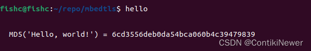

1、新建文件夹mbedtls，然后再进入该目录。
```
mkdir mbedtls
cd mbedtls

```

2、从github上克隆代码，也可以直接去官网下载。
```
git clone https://github.com/ARMmbed/mbedtls.git
```
3、切换到某个分支
```
git branch -a //查看有哪些分支

git checkout -b mbedtls-2.28 origin/mbedtls-2.28 //选择可用分支并更换

git branch //查看分支
```

4、安装cmake
```
sudo apt-get update
sudo apt-get install cmake

```

5、编译、安装debug版mbedtls
```
cmake -D CMAKE_BUILD_TYPE=Debug -DUSE_SHARED_MBEDTLS_LIBRARY=On .

make

sudo make install
```


6、修改mbedtls配置
```
# 删除之前cmake相关中间文件，但是不包括CMakeLists.txt文件
find . -iname '*cmake*' -not -name CMakeLists.txt -exec rm -rf {} +

# 指定配置文件为 config-ccm-psk-tls1_2.h，重新编译
CFLAGS="-I$PWD/configs -DMBEDTLS_CONFIG_FILE='<config-ccm-psk-tls1_2.h>'" cmake .
```

7、检验
