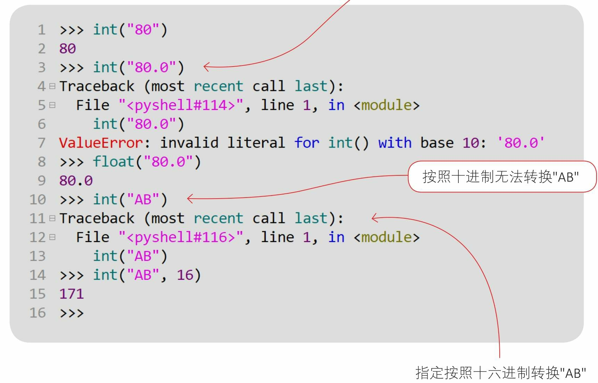
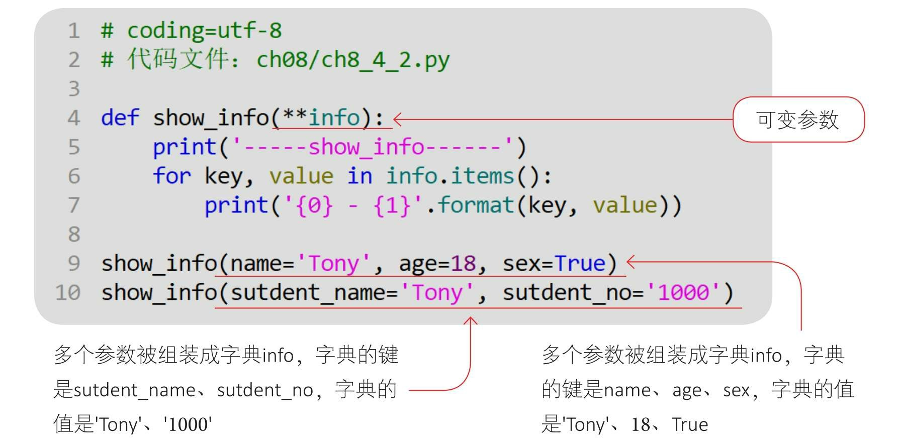

按位取反运算
+ 公式：~a=(a+1) × -1

运算符的优先级


循环
+ for循环和while循环类似，可以带有else子语句


序列
+ 序列包括列表（list）、字符串（str）、元组（tuple）和字节序列 （bytes）等。
+ len()函数获取序列的长度
+ max()函数用于返回最后一个元素
+ min()函数用于返回第一个元素
+ 加(+)运算符可以将两个序列连接起来
+ 乘(*)运算符可以将两个序列重复 多次

+ 切片操作：序列的切片（Slicing）就是从序列中切分出小的子序列。
  + 切片运算符的语法形式为[start：end：step]。其中，start是开始索引 ，end是结束索引，step是步长（切片时获取的元素的间隔，可以为正整 数，也可以为负整数）。
  + 注意：切下的小切片包括start位置的元素，但不包括end位置的元素 ，start和end都可以省略。
  + 省略开始索引，默认开始索引是0；省略结束索引，默认结束索引是序列的长度；省略步长，默认步长是1；
+ 成员测试
  + 成员测试运算符有两个：in和not in，in用于测试是否包含某一个元素，not in用于测试是否不包含某一个元素。
  

列表
+ 创建列表
  + list(iterable)函数：参数iterable是可迭代对象（字符串、列表、 元组、集合和字典等）。 
  + [元素1，元素2，元素3，⋯]：指定具体的列表元素，元素之间以逗号分隔，列表元素需要使用中括号括起来。
+ 列表中元素的类型可以不同
  + ['hello','world',1,2,3]则是字符串和整数混合的列表

+ 追加元素
  + 列表是可变的序列对象，列表可以追加元素。
  + 在列表中追加单个元素时，可以使用列表的append(x)方法。
  + 在列表中追加多个元素时，可以使用加(+)运算符或列表的extend(t)方法。
  

+ 方法和函数的区别


+ 插入元素
  + 想向列表中插入元素时，可以使用列表的list.insert(i,x)方法，其中，i指定索引位置，x是要插入的元素。
  

+ 删除元素
  + 想在列表中删除元素时，可使用列表的list.remove(x)方法，如果找到匹配的元素x，则删除该元素，如果找到多个匹配的元素，则只删除第一个匹配的元素。
  


元组
+ 元组(tuple)是一种不可变序列类型。
+ 创建元组
  + tuple(iterable)函数：参数iterable是可迭代对象（字符串、列表、元组、集合和字典等）。
  
  + (元素1，元素2，元素3，⋯)：指定具体的元组元素，元素之间以逗号分隔。对于元组元素，可以使用小括号括起来，也可以省略小括号。
  
  
+ 元组拆包
  + 创建元组，并将多个数据放到元组中，这个过程被称为元组打包。与元组打包相反的操作是拆包，就是将元组中的元素取出，分别赋值给不同的变量。
  
  
  例：将元组(102，'张三')拆包到变量s_id和s_name
  


集合
+ 集合(set)是一种可迭代的、无序的、不能包含重复元素的容器类型的数据。


+ 创建集合
  + set(iterable)函数：参数iterable是可迭代对象(字符串、列表、 元组、集合和字典等)。
  + {元素1，元素2，元素3，⋯}：指定具体的集合元素，元素之间以逗号分隔。对于集合元素，需要使用大括号括起来。
  

+ 修改集合
  + 修改集合类似于修改列表，可以向其中插入和删除元素。
  + add(elem)：添加元素，如果元素已经存在，则不能添加，不会抛出错误。 
  + remove(elem)：删除元素，如果元素不存在，则抛出错误。 
  + clear()：清除集合。

字典
+ 字典(dict)是可迭代的、通过键(key)来访问元素的可变的容器类型的数据。

+ 创建字典
  + dict()函数
  + {key1：value1，key2：value2，...，key_n：value_n}：指定具体的字典键值对，键值对之间以逗号分隔，最后用大括号括起来。
例：


+ 修改字典
  


+ 访问字典视图
  + items() : 返回字典的所有键值对视图
  + keys() : 返回字典键视图
  + values() : 返回字典值视图  

    ```
    第2行：返回字典的所有键值对视图dict_items 
    第4行：dict_items可以使用list()函数返回键值对列表 
    第6行：返回字典键视图dict_keys 
    第8行：dict_keys可以使用list()函数返回键列表 
    第10行：返回字典值视图dict_values 
    第12行：dict_values可以使用list()函数返回值列表
    ```
+ 遍历字典
   


字符串


+ 长字符串
  + 如果要使用字符串表示一篇文章，其中包含了换行、缩进等排版字符，则可以使用长字符串表示。对于长字符串，要使用三个单引号( ''' )或三个双引号(＂＂＂)括起来。


+ 字符串转数字

  + 在默认情况下，int()函数都将字符串参数当作十进制数字进行转换，所以int('AB')会失败。int()函数也可以指定进制。


+ 占位符


+ 字符串的格式化控制


+ 字符串查找
  + 字符串的find()方法用于查找子字符串。该方法的语法为str.find(sub[，start[，end]])，表示：在索引start到end之间查找子字符串sub ，如果找到，则返回最左端位置的索引；如果没有找到，则返回-1。
  + [，start[，end]]表示参数可选填，要是没有start参数，则表示从头开始查找；要是没有end参数，则表示查找到字符串的末尾
  


+ 字符串替换
  + 若想进行字符串替换，则可以使用replace()方法替换匹配的子字符串，返回值是替换之后的字符串。该方法的语法为str.replace(old，new[，count])，表示：用new子字符串替换old子字符串。count参数指定了替换old子字符串的个数，如果count被省略，则替换所有old子字符串。

+ 字符串分割
  + 若想进行字符串分割，则可以使用split()方法，按照子字符串来分割字符串，返回字符串列表对象。该方法的语法为str.split(sep，maxsplit)，表示：使用sep子字符串分割字符串str。maxsplit是最大分割次数，如果maxsplit被省略，则表示不限制分割次数。
  


函数

+ 可变参数
  + python中的函数可以定义接收不确定数量的参数，这种参数被称为可变参数。可变参数有两种，即在参数前加*或**
  + 基于元组的可变参数（*可变参数）
    + *可变参数在函数中被组装成一个元组。
  
  + 基于字典的可变参数（**可变参数）
  


+ 全局变量和局部变量
  + 若在函数中将变量声明为global，则会将函数中的变量提升为全局变量
  

+ 函数类型
  + Python中的任意一个函数都有数据类型，这种数据类型是function，被称为函数类型。
  + 函数类型的数据与其他类型的数据是一样的，任意类型的数据都可以作为函数返回值使用，还可以作为函数参数使用。因此，一个函数可以作为另一个函数返回值使用，也可以作为另一个函数参数使用。


+ 过滤函数filter()
  + filter()函数用于对容器中的元素进行过滤处理。
  
  + filter()函数的语法：filter(function, iterable)
    + 参数function是一个提供过滤条件的函数，返回布尔值。
    + 参数iterable是容器类型的数据，可迭代对象。
    
    + 实例：
    
    + filter()函数的返回值并不是一个列表，如果需要返回列表类型的数据，则还需要通过list()函数进行转换

+ 映射函数map()
  + map()函数用于对容器中的元素进行映射（或变换）。例如：我 想将列表中的所有元素都乘以2，返回新的列表。
  
  + map()函数的语法：map(function,iterable)
  + 在调用map()函数时，iterable会被遍历，它的元素被逐一传入function()函数中，在function()函数中对元素进行变换
  

+ lambda()函数
  + lambda()函数的语法如下：
    ```
    lambda 参数列表:lambda体
    ```
  + lambda体部分只有一条语句，语句会计算一个结果并返回给lambda()函数
  + 实例：
    
    


类
+ 构造方法
  + \__init__()方法是构造方法，用来初始化实例变量

+ 类变量
  + 所有账户实例共享的变量，它属于类，被称为“类变量”。
  + 对类变量通过“类名.类变量”形式访问


+ 类方法
  
  + 类方法可以访问类变量和其他类方法，但不能访问其他实例方法和实例变量。


+ 私有变量
  + 为了防止外部调用者随意存取类的内部数据（成员变量），内部数据（成员变量）会被封装为“私有变量”。外部调用者只能通过方法调用私有变量。
  + 在默认情况下，Python中的变量是公有的，可以在类的外部访问它们。如果想让它们成为私有变量，则在变量前加上双下画线（__）即可
  + 实例
  

+ 私有方法
  + 在方法前加上双下画线（__）就是私有方法了
    

  + 使用属性
  + 属性在本质上就是两个方法，在方法前加上装饰器
  

+ 继承
  + 实例：
  
  + 结果：
    
  + 子类继承父类时，只会继承公有的成员变量和方法
  + 在Python中，当子类继承多个父类时，如果在多个父类中有相同的成员方法或成员变量，则子类优先继承左边父类中的成员方法或成员变量，从左到右继承级别从高到低。
  + 方法重写
    + 如果子类的方法名与父类的方法名相同，则在这种情况下，子类的方法会重写（Override）父类的同名方法。

+ 多态性
  + “多态”指对象可以表现出多种形态
    + 例如，猫、狗、鸭子都属于动物，它们有“叫”和“动”等行为，但是叫的方式不同，动的方式也不同。
    + 在多个子类继承父类，并重写父类方法后，这些子类所创建的对象之间就是多态的。这些对象采用不同的方式实现父类方法。
    + 鸭子模型
      + ！！！


异常处理
  + 实例：
  
  + 结果：
  
  + 自定义异常类
  


正则表达式模块
  + 正则表达式指预先定义好一个“字符串模板”，通过这个“字符串模板”可以匹配、查找和替换那些匹配“字符串模板”的字符串。


