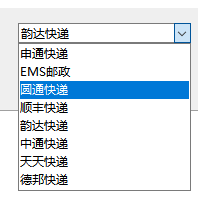
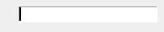

```
Label_2控件中绑定了3个变量：Count、MidCount、OpType

def Button_17_onCommand(uiName,widgetName):
    MidCount = Fun.GetUserData(uiName,'Label_2','Count')
    Fun.SetUserData(uiName,'Label_2','OpType',3)
    Fun.SetUserData(uiName,'Label_2','MidCount',MidCount)
    Fun.SetUserData(uiName,'Label_2','Count',0.0)

```


弹出一个消息对话框
```
Fun.MessageBox("要显示的内容")

```

### ComboBox


### Entry



