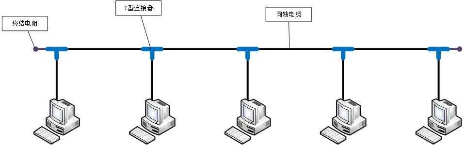

C\C++跨平台
+ 使用各平台相关的编译器生成对应平台的可执行文件

MAC地址（网卡地址）

两台电脑想直接通信可以用交叉线

通过ARP广播得到MAC地址

同轴电缆

+ 半双工通信
+ 容易冲突
+ 不安全
+ 中间断了，整个都瘫了


集线器

+ 半双工通信
+ 容易冲突
+ 不安全
+ 跟同轴电缆一样：没有智商


网桥
+ 能够通过自学习得知每个接口那侧的MAC地址
+ 从而起到隔绝广播域的作用


交换机
+ 全双工通信
+ 相当于接口更多的网桥

路由器
+ 可以在不同网段之间转发数据
+ 隔绝广播域
+ 主机发数据之前，首先会判断目标主机的IP地址跟它是否在同一个网段
  + 在同一个网段：发送ARP广播、通过交换机\集线器传递数据集
  + 不在同一个网段：通过路由器转发数据
+ 设置网关
  + 网关的IP地址要与所连的网段在同一网段


ISP : 网络服务提供商
+ 我们平时拉的宽带都是通过ISP连接到Internet的

MAC地址

广播地址:48位全为1
+ FF-FF-FF-FF-FF-FF

IP地址
+ 由网络标识（网络ID）和主机标识（主机ID）组成
+ 同一网段的计算机，网络ID相同
+ 通过子网掩码可以计算出网络ID：子网掩码 & IP地址

IP地址的分类


子网划分
+ 等长子网划分
  + 将一个网段等分为多个子网，每个子网的可用IP地址数量是一样的
+ 变长子网划分
  + 每个子网的可用IP地址数量可用是不一样的


超网：跟子网反过来，它是将多个连续得到网段合并成一个更大的网段

判断一个网段是子网还是超网


默认情况下，路由器只知道跟它直连的网段，非直连的网段需要通过静态路由、动态路由告诉它


局域网（Local Area Network, LAN）
+ 一般是范围在几百米到十几公里内的计算机所构成的计算机网络
+ 常用于公司、家庭、学校、医院、机关、一幢大楼等
+ 局域网中使用最广泛的网络技术叫：以太网
+ 在电脑、手机上经常见到的一个英文(WLAN)，意思是无线局域网


城域网(MAN)
+ 一般范围是数十公里到数百公里，可以覆盖一个城市


广域网(WAN)
+ 一般范围是几百公里到几千公里，可用覆盖一个国家。通常都需要租用ISP的线路


猫（Modem），调制解调器，进行数字信号和模拟信号的转换
光猫（Optical Modem），光调制解调器，进行数字信号和光信号的转换

私网IP访问Internet需要进行NAT转换为公网IP
+ NAT(Network Address Translation)
+ 这一步可以由路由器来完成


NAT的分类
+ 静态转换
  + 手动配置NAT映射表
  + 一对一转换
+ 动态转换
  + 定义外部地址池，动态随即转换
  + 一对一转换
+ PAT(Port Address Translation)
  + 多对一转换，最大程度节约公网资源
  + 采用端口多路复用，通过端口号标识不同的数据流
  + 目前应用最广泛的NAT实现方式

网络分层

# 物理层
物理层定义了接口标准、线缆标准、传输速率、传输方式等


信道
+ 信息传输的通道，一条传输介质上（比如网线）上可以有多条信道


# 数据链路层
链路：从1个节点到相邻节点的一段物理线路（有线或无线），中间没有其他交换节点

数据链路：在一条链路上传输数据时，需要有对应的通信协议来控制数据的传输

不同类型的数据链路，所用的通信协议可能是不同的
+ 广播信道：CSMA/CD协议（比如同轴电缆、集线器等组成的网络）
+ 点对点信道：PPP协议（比如2个路由器之间的信道）

## CSMA/CD协议
+ 载波侦听多路访问/冲突检测
+ 使用了CSMA/CD的网络可以称为是以太网，它传输的是以太网帧
+ 为了能够检测正在发送的帧是否产生了冲突，以太网的帧至少要64字节
+ 用交换机组建的网络，已经支持全双工通信，不需要再使用CSMA/CD，但它传输的帧依然是以太网帧，所以，用交换机组建的网络，依然可以叫做以太网


## Ethernet V2帧的格式


## PPP协议

◼ Address字段：图中的值是0xFF，形同虚设，点到点信道不需要源MAC、目标MAC地址
◼ Control字段：图中的值是0x03，目前没有什么作用
◼ Protocol字段：内部用到的协议类型
◼ 帧开始符、帧结束符：0x7E

## 网卡

◼ 网卡接收到一个帧，首先会进行差错校验，如果校验通过则接收，否则丢弃
◼ Wireshark抓到的帧没有FCS ，因为它抓到的是差错校验通过的帧（帧尾的FCS会被硬件去掉）
◼ Wireshark抓不到差错校验失败的帧


# 网络层


1.确定主机字节序程序
```
#include<stdio.h>
union{
	short s;
	char c[sizeof(short)];
}un;
int main()
{
	un.s = 0x0102;
	if ((un.c[0] == 1) && (un.c[1] == 2))
	{
		printf("big-endian\n");
	}
	if ((un.c[0] == 2) && (un.c[1] == 1))
	{
		printf("little-endian\n");
	}
	return 0;
}
```
2.字节序转换
```
#include <stdio.h>
#include <arpa/inet.h>

int main(int argc, char const *argv[])
{
    int a = 0x12345678;
    short b = 0x1234;

    printf("%#x\n", htonl(a));
    printf("%#x\n", htons(b));

    return 0;
}


```


